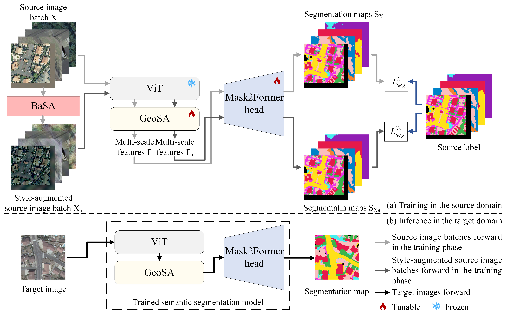

# Domain Generalization for Semantic Segmentation of Remote Sensing Images via Vision Foundation Model Fine-tuning
[Muying Luo](https://orcid.org/0009-0007-0603-3590)<sup>1</sup>, [Yujie Zan](https://orcid.org/0009-0006-6454-0577)<sup>1</sup>, [Kourosh Khoshelham](https://orcid.org/0000-0001-6639-1727)<sup>2</sup>,[Shunping Ji](https://orcid.org/0000-0002-3088-1481)<sup>1</sup>. <br />
<sup>1</sup> Wuhan University    <sup>2</sup> The University of Melbourne


The GeoSA-BaSA framework incorporates two key modules, the Geospatial Semantic Adapter (GeoSA), and the Batch Style Augmenter (BaSA), which together unlock the potential of VFMs for domain generalization in remote sensing image semantic segmentation.



## Environment Setup
The requirements can be installed with:
```bash
conda create -n geosa-basa -y
conda activate geosa-basa
conda install pytorch==2.0.1 torchvision==0.15.2 torchaudio==2.0.2 pytorch-cuda=11.7 -c pytorch -c nvidia -y
pip install -U openmim
mim install mmengine
mim install "mmcv>=2.0.0"
pip install "mmsegmentation>=1.0.0"
pip install "mmdet>=3.0.0"
pip install xformers=='0.0.20' # optional for DINOv2
pip install -r requirements.txt
pip install future tensorboard
```

## Dataset Preparation
**WHU-Mix building dataset:** Download `train.zip` and `test.zip` from [WHU-Mix (Raster) Dataset](https://gpcv.whu.edu.cn/data/whu-mix(raster)/whu_mix%20(raster).html).

**OEM dataset:** Download `OpenEarthMap.zip` from [OpenEarthMap Dataset](https://zenodo.org/records/7223446). The xBD RGB images from https://xview2.org/dataset should be also downloaded and added to the corresponding folders.

**FLAIR dataset:** Download `flair_aerial_train.zip`, `flair_1_aerial_test.zip`, `flair_labels_train.zip` and `flair_1_labels_test.zip` from [FLARI dataset](https://ignf.github.io/FLAIR/FLAIR1/flair_1.html).

**LandCover.ai dataset:** Download dataset from [LandCover.ai website](https://www.kaggle.com/datasets/adrianboguszewski/landcoverai/data). The downloaded folder contains two subfolders: "images" and "masks".

Prepare datasets with these commands:
```shell
cd GeoSA-BaSA
mkdir data
# Convert data for training and validation if preparing for the first time
python tools/convert_datasets/preprocess_whumix.py --input-dir /path/to/whumix
python tools/convert_datasets/preprocess_oem.py --oem-root /path/to/oem
python tools/convert_datasets/preprocess_flair.py --zip-dir /path/to/flair_zips  #it takes a long time
python tools/convert_datasets/preprocess_landcoverai.py --in-base /path/to/landcoverai_dir
```

The final folder structure should look like this:

```
GeoSA-BaSA
├── ...
├── data
│   ├── whumix 
│   │   ├── train #source domain  39346 images
│   │   │   ├── image
│   │   │   ├── label01
│   │   ├── kitsap   #3600 images
│   │   │   ├── image
│   │   │   ├── label01
│   │   ├── wuxi  #1409 images
│   │   │   ├── image
│   │   │   ├── label01
│   │   ├── dunedin  #1312 images
│   │   │   ├── image
│   │   │   ├── label01
│   │   ├── potsdam  #1176 images
│   │   │   ├── image
│   │   │   ├── label01
│   │   ├── khartoum  #905 images
│   │   │   ├── image
│   │   │   ├── label01
│   ├── oem
│   │   ├── trainval  #13307 images
│   │   │   ├── image
│   │   │   ├── label01
│   ├── flair
│   │   ├── train  #source domain  47712  images
│   │   │   ├── image
│   │   │   ├── label
│   │   ├── test  #15700 images
│   │   │   ├── image
│   │   │   ├── label
│   ├── landcoverai  
│   │   ├── landcoverai025  #source domain 11286 images
│   │   │   ├── image
│   │   │   ├── label
│   │   ├── landcoverai05   #720 images
│   │   │   ├── image
│   │   │   ├── label
├── ...
```
## Pretraining Weights
* **Download:** Download pre-trained weights. Place them in the 'pretrained_weights' directory without changing the file name.

  | Model  | Type | Link |
  |-------|-----|:-----:|
  | Dinov2 | `dinov2_vitl14_pretrain.pth`                |[official repo](https://dl.fbaipublicfiles.com/dinov2/dinov2_vitl14/dinov2_vitl14_pretrain.pth)|
  | EVA02  | `eva02_L_pt_m38m_p14to16.pt`                |[official repo](https://huggingface.co/Yuxin-CV/EVA-02/blob/main/eva02/pt/eva02_L_pt_m38m_p14to16.pt)|
  | CLIP      | `ViT-L-14.pt` |[official repo](https://openaipublic.azureedge.net/clip/models/b8cca3fd41ae0c99ba7e8951adf17d267cdb84cd88be6f7c2e0eca1737a03836/ViT-L-14.pt)|

* **Convert:** Convert pre-trained weights for training or evaluation.
  ```bash
  python tools/convert_models/convert_dinov2.py pretrained_weights/dinov2_vitl14_pretrain.pth pretrained_weights/dinov2_converted.pth
  ```

### Checkpoints
- You can download **GeoSA-BaSA** model checkpoints and Place them in the 'checkpoints' directory.

  | Model | Pretrained | Trained on   | Link |
  |-----|--------------|-----|:-----:|
  | `whumix_dinov2_geosa_basa` | Dinov2 | WHU-Mix      |[download link](https://drive.google.com/file/d/1S27DTPc9ZInfznPRTB2JyFn-uc3cvXUa/view?usp=sharing)|
  | `flair_dinov2_geosa_basa` | Dinov2 | FLAIR        |[download link](https://drive.google.com/file/d/1uxqdMRWKe-wCu3j8Wp_qjIi4X2XrMqI1/view?usp=sharing)|
  | `landcoverai_dinov2_geosa_basa` | Dinov2 | LandCover.ai |[download link](https://drive.google.com/file/d/13cdNY3fQ0bdbZMmfTQpRdbr5gRehhRkQ/view?usp=sharing)|


## Evaluation
  Run the evaluation:
  ```
  python tools/test.py configs/dinov2/geosa_basa_dinov2_mask2former_512x512_bs1x4_whumix.py checkpoints/geosa_basa_whumix.pth --backbone ./pretrained_weights/dinov2_converted.pth
  ```
  For most of provided release checkpoints, you can run this command to evluate
  ```
  python tools/test.py /path/to/cfg /path/to/checkpoint \
    --backbone /path/to/dinov2_converted.pth \
    [--work-dir /path/to/test_dir] \
    [--out /path/to/save_output_prediction]
  ```

## Training
Training in single GPU:
```
#whu-mix
python tools/train.py configs/dinov2/geosa_basa_dinov2_mask2former_512x512_bs1x4_whumix.py
#flair
python tools/train.py configs/dinov2/geosa_basa_dinov2_mask2former_512x512_bs1x4_flair.py
#landcoverai
python tools/train.py configs/dinov2/geosa_basa_dinov2_mask2former_512x512_bs1x4_landcoverai.py
```

## Acknowledgment
Our implementation is mainly based on following repositories. Thanks for their good works.
* [MMSegmentation](https://github.com/open-mmlab/mmsegmentation)
* [Rein](https://github.com/w1oves/Rein)
* [ViT-Adapter](https://github.com/czczup/ViT-Adapter)


